# Roblox Prison Tool Showcase

## 🎮 Overview
This repository showcases a collection of **custom Roblox tools** designed for a **Prison-style game**.
Each tool features unique mechanics, physics interactions, and combat systems.

---

## 🧰 Tool Showcase

---

### 1️⃣ BlackHole Tool
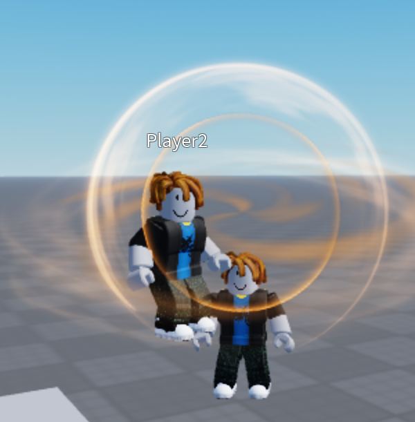

Creates a black hole that **pulls nearby players toward its center**.
Players who are fully absorbed receive **instant kill damage**.

**Key Mechanics:**
- Area suction force
- Physics-based pull
- Instant elimination

---

### 2️⃣ DonutZooka Tool
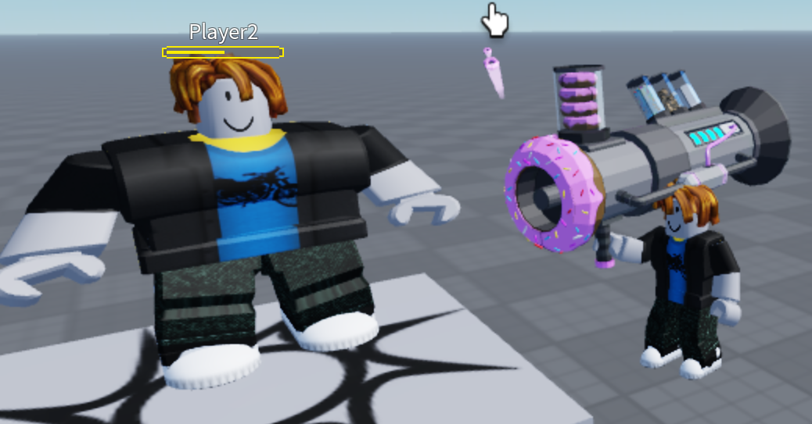

Fires donuts at players.  
Each hit makes the target **fatter**, and after **10 hits**, the player **explodes and dies instantly**.

**Key Mechanics:**
- Progressive player scaling
- Hit counter system
- Unique instant-death condition

---

### 3️⃣ Flying Carpet Tool
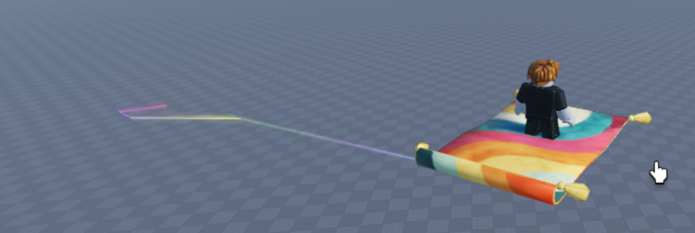

Allows the player to **fly freely** using a magical flying carpet.

**Key Mechanics:**
- Smooth flight control
- Air movement physics
- Fun mobility system

---

### 4️⃣ Ghost Tool
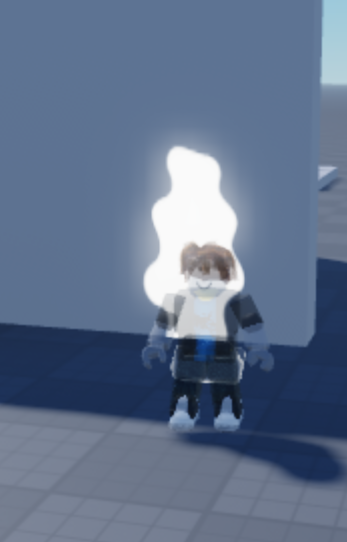

Allows the player to **pass through walls from the front side** and leaves a **temporary trail** on the wall.

**Key Mechanics:**
- Direction-based wall phasing
- Temporary visual effects
- Collision bypass logic

---

### 5️⃣ IceBow Tool
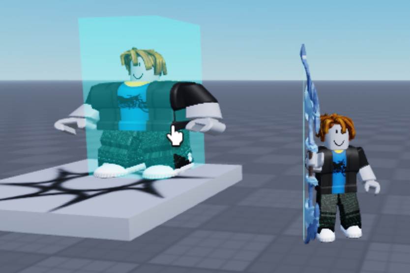

Shoots ice arrows that **trap players inside an ice prison**, preventing movement.

**Key Mechanics:**
- Projectile freezing
- Player immobilization
- Ice cage effect

---

### 6️⃣ LaserBeam Tool
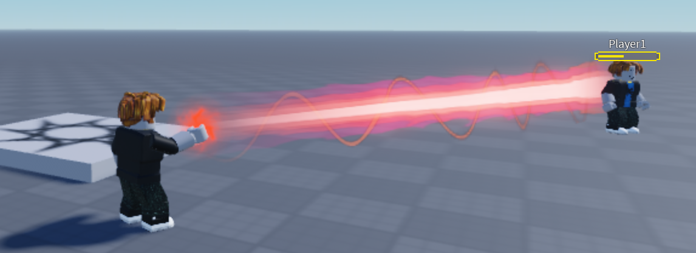

Shoots a laser beam from the player’s head that applies **continuous knockback** and **damage over time**.

**Key Mechanics:**
- Continuous beam logic
- Knockback loop
- HP reduction system

---

### 7️⃣ Punch Tool
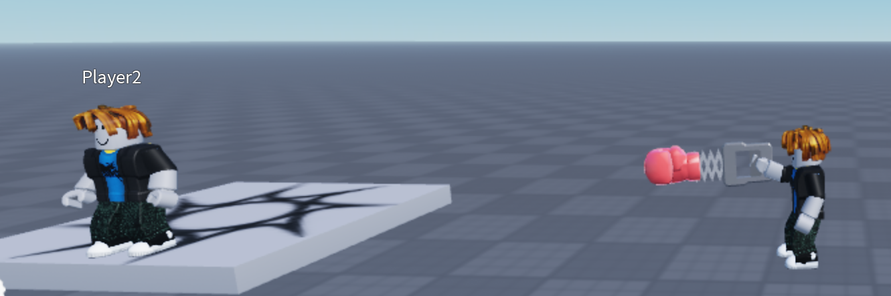

Punches enemies and sends them **flying away** using strong knockback.

**Key Mechanics:**
- Physics-based knockback
- Close combat interaction
- Force impulse system

---

### 8️⃣ SuperFoodZooka Tool
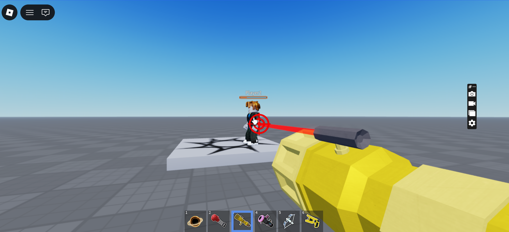

Shoots food projectiles at enemies and switches the camera to **FPS mode**, dealing damage.

**Key Mechanics:**
- FPS camera system
- Projectile damage
- Mode switching

---

### 9️⃣ Taser Tool
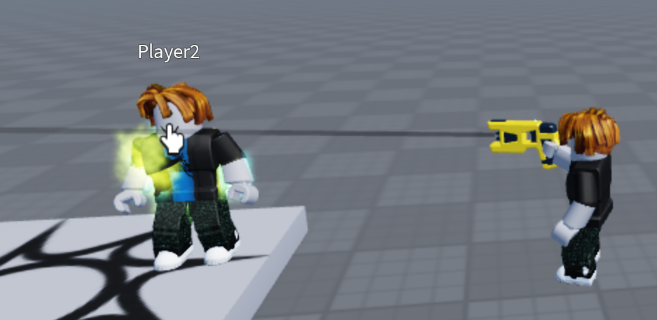

Stuns other players for several seconds, disabling movement and actions.

**Key Mechanics:**
- Stun duration logic
- Crowd control system
- Temporary player lock

---

### 🔟 Telekinesis Tool
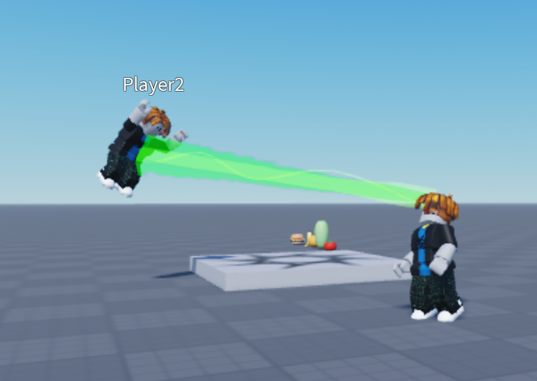

Lifts other players into the air and allows full **directional control**.

**Key Mechanics:**
- Physics manipulation
- Player control override
- Direction targeting

---

### 1️⃣1️⃣ Truck Tool
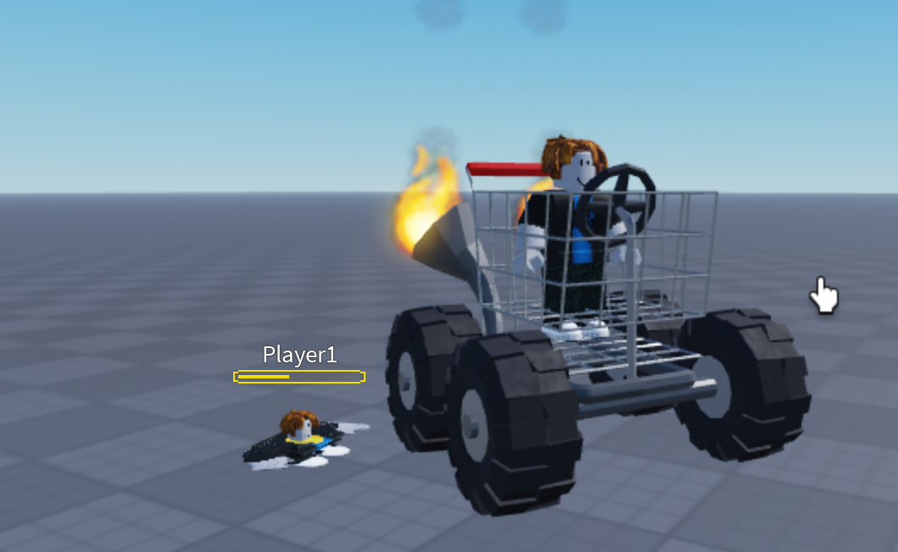

Spawns a trolley truck.  
Players hit by the truck become **flattened, smaller**, and take **high damage**.

**Key Mechanics:**
- Vehicle collision detection
- Player scaling effects
- High-impact damage

---

### 1️⃣2️⃣ Vacuum Tool
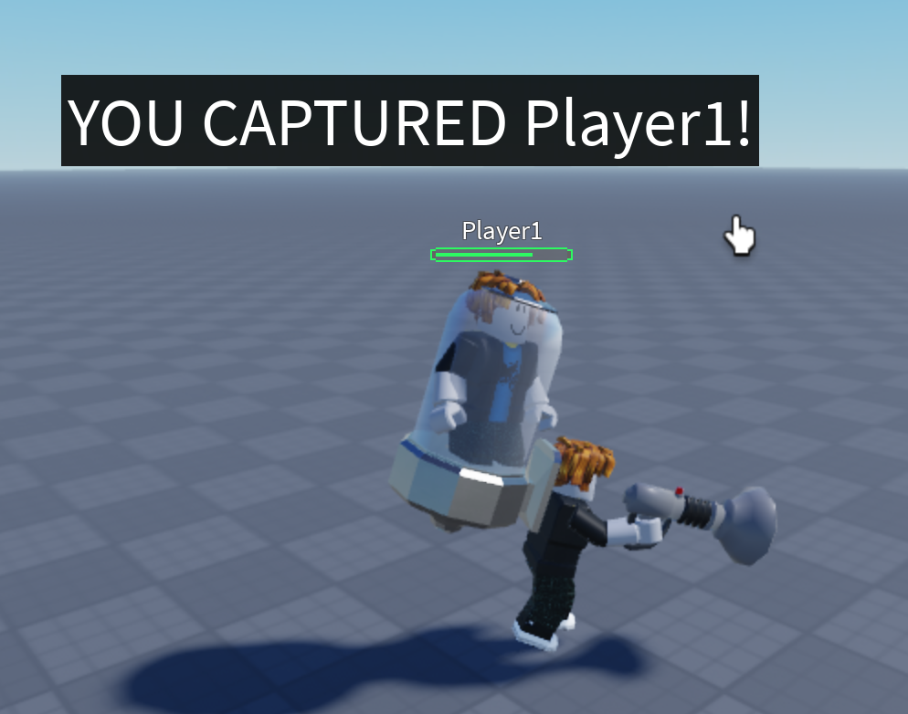

Allows the player to **suck other players toward the tool** using strong suction force.

**Key Mechanics:**
- Suction physics
- Player attraction
- Area control
- 
---

## 📂 Repository Structure
ScreenshotRoblox/
├── ScreenshotBlackHoleTool.png
├── ScreenshotDonutZookaTool.png
├── ScreenshotFlyingCarpetTool.png
├── ScreenshotGhostTool.png
├── ScreenshotIceBowTool.png
├── ScreenshotLaserBeamTool.png
├── ScreenshotPunchTool.png
├── ScreenshotSuperFoodZookaTool.png
├── ScreenshotTaserTool.png
├── ScreenshotTelekinesisTool.png
├── ScreenshotTruckTool.png
└── ScreenshotVacoomTool.png

VideoRoblox/
├── BlackHoleTool.mp4
├── DonutZookaTool.mp4
├── FlyingCarpetTool.mp4
├── GhostTool.mp4
├── IceBowTool.mp4
├── LaserBeamTool.mp4
├── PunchTool.mp4
├── SuperFoodZookaTool.mp4
├── TaserTool.mp4
├── TelekinesisTool.mp4
├── TruckTool.mp4
└── VacoomTool.mp4

---

## 🧠 Skills Demonstrated
- Roblox Lua scripting
- Physics & force manipulation
- Player state control
- Combat tool systems
- Camera & movement mechanics
- Creative gameplay design

---

## 📌 Notes
This project is published as a **gameplay showcase and portfolio project**.
Screenshots and videos demonstrate each tool’s behavior in-game.

---

## 👤 Author
GitHub: https://github.com/Khan05
